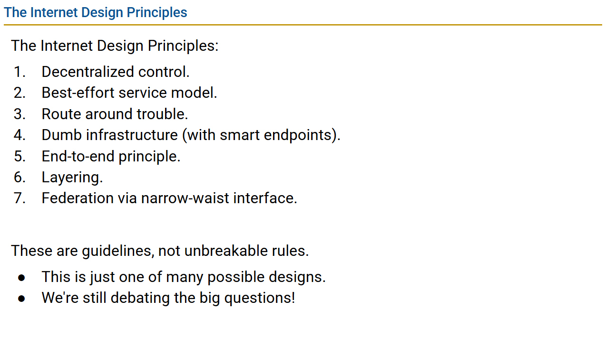

# UCB network

# Design challenge

1.Internet is federated

2.handle failure at sacle

3.asychrony

4.diverse

5.keep evolving

# Layers of network

1. physical layer: 信息传递的物理媒介
2. link layer : 直接在物理layer上连接的计算机组成的局域网.
3. Internet : 由所有局域网相连组成的互联网.

Layer 3不保证packet一定送到目标地址. packet可能会lost, reordered, corrupted.并不会告知错误.

所以需要layer 4 transport,保证packet送到且无误.

Layer 5,6 被废弃了.

layer 7 应用层. 用户直接交互.

# header

包含一些元数据, 例如发送接受者地址, packet size.

# packet传输过程

假设host A 传packet给host B. 会经过以下过程:

### 旅程开始：在 Host A (发送者)

数据在这里被 **“封装”** (Encapsulation)，像套娃一样一层包一层。

- **Layer 7 (应用层):**
    - **作用：** 准备要发送的数据。
    - **数据：** `"Potato."` (这是一个 HTTP GET 请求)
- **Layer 4 (传输层):**
    - **作用：** 管理端到端的连接，分配端口号。
    - **操作：** 加上一个 **TCP 头部**。
        - `Source Port` (源端口): `49152` (一个随机的高端口号)
        - `Destination Port` (目标端口): `80` (HTTP的默认端口)
    - **结果：** [ TCP 头部 | "Potato." ]，这被称为一个 **"Segment" (数据段)**。
- **Layer 3 (网络层 / Internet):**
    - **作用：** 加上全局的“最终地址”。
    - **操作：** 加上一个 **IP 头部**。
        - `Source IP` (源IP): `IP_A` (192.168.1.10)
        - `Destination IP` (目标IP): `IP_B` (172.16.5.50)
    - **结果：** [ IP 头部 | TCP 头部 | "Potato." ]，这被称为一个 **"Packet" (数据包)**。
    - **A的思考：** "目标 `IP_B` (172.16.5.50) 不在我的本地网络 (192.168.1.0)，我必须把它发给我的**网关（Gateway）**，也就是 `Router 1` (192.168.1.1)。"
- **Layer 2 (链路层 / Link):**
    - **作用：** 加上“下一跳”的“本地地址”。
    - **操作：** 加上一个 **Link 头部** (比如以太网帧头)。
        - `Source MAC` (源MAC): `MAC_A` (Host A 自己的 MAC)
        - `Destination MAC` (目标MAC): `MAC_R1_A` (**Router 1 的 MAC**)。
        - *(注意：Host A 通过 ARP 协议找到 `IP_R1_A` 对应的 MAC 地址是 `MAC_R1_A`)*
    - **结果：** [ Link 头部 | IP 头部 | TCP 头部 | "Potato." ]，这被称为一个 **"Frame" (数据帧)**。
- **Layer 1 (物理层):**
    - **作用：** 把数据帧转换成电子信号。
    - **操作：** 把这个"Frame"的 0 和 1 序列变成电信号（或光信号、无线电波），通过网线发送出去。

### 第一站：在 Router 1

路由器在这里进行 **“解封装”** 然后 **“重新封装”**。

- **Layer 1:** 接收电信号，将其转换回 0 和 1 的 "Frame"。
- **Layer 2:**
    - **作用：** 检查这个“Frame”是不是给我的。
    - **操作：** 查看 "Frame" 的 `Destination MAC`。**“是 `MAC_R1_A`！这是发给我的。”**
    - **操作：** **“拆掉” (Decapsulate) L2 的 Link 头部**，把里面的 "Packet" 取出来，交给 L3。
- **Layer 3:**
    - **作用：** 决定下一步该往哪走（路由）。
    - **操作：** 查看 "Packet" 的 `Destination IP`。**“是 `IP_B` (172.16.5.50)，这不是给我的。”**
    - **操作：** **查询自己的路由表 (Routing Table)**。
    - **路由决策：** “根据我的路由表，要去 `172.16.5.0` 这个网络，我必须把包从我的**接口2** (`IP_R1_B`) 发给 `Router 2` (`IP_R2_A` / 10.0.0.2)。”
    - **操作：** 把这个**原封不动的 "Packet"** 向下交给 L2。
- **Layer 2 (再次):**
    - **作用：** 为下一跳（Router 1 -> Router 2）封装一个新的 "Frame"。
    - **操作：** 加上一个**全新的 Link 头部**。
        - `Source MAC`: `MAC_R1_B` (Router 1 自己的**出口** MAC)
        - `Destination MAC`: `MAC_R2_A` (**Router 2 的 MAC**)
    - **结果：** [ **新 Link 头部** | IP 头部 | TCP 头部 | "Potato." ]
- **Layer 1 (再次):** 把这个**新的 "Frame"** 转换成信号，通过连接 Router 2 的网线发出去。

### 第二站：在 Router 2

操作与router 1相似, 只是将packet发给host B

### 终点站：在 Host B (接收者)

数据在这里被 **“解封装”** (Decapsulation)，一层层拆开。

- **Layer 1:** 接收电信号，转换回 "Frame"。
- **Layer 2:**
    - **作用：** 检查这个“Frame”是不是给我的。
    - **操作：** 查看 `Destination MAC`。**“是 `MAC_B`！这是发给我的。”**
    - **操作：** “拆掉” L2 头部，把 "Packet" 取出来，交给 L3。
- **Layer 3:**
    - **作用：** 检查这个“Packet”是不是给我的。
    - **操作：** 查看 `Destination IP`。**“是 `IP_B`！这是发给我的。”**
    - **操作：** “拆掉” L3 头部，把 "Segment" 取出来，交给 L4。
- **Layer 4:**
    - **作用：** 检查这个“Segment”该给哪个应用程序。
    - **操作：** 查看 `Destination Port`。**“是 `80` 端口！这是给我的 Web 服务器的。”**
    - **操作：** “拆掉” L4 头部，把“数据”取出来，交给 L7。
- **Layer 7:**
    - **作用：** 处理数据。
    - **操作：** Web 服务器收到了数据：**`"Potato."`**。
    
    # design principles
    
    
    
    
    


# 路由

解决的问题: A要给B发消息, 他怎么知道发给哪个路由器中转? 以及多条路径的选择.

互联网是由多个网络互联构成的网络, 因此所用的路由协议并不相同. 但是一个网络内部使用的路由协议是相同的. 被称为IGP. 网络之间的路由协议称为BGP.

对于IGP, 实现路由的算法通常是链路状态算法:

### 链路状态 (Link-State) 算法

这是现代IGP（内部网关协议）的主流算法。它的工作原理是“**构建完整的地图**”。

- **代表协议**：**OSPF** (Open Shortest Path First)
- **核心算法**：**Dijkstra (迪杰斯特拉)** 算法，也叫 **SPF (最短路径优先)**
1. **步骤 1：建立邻居关系 (Adjacency)**
    - 路由器通过发送 **Hello** 包来发现直连的邻居。
    - 它们交换参数，建立“邻居关系”，同意互相交换信息。
2. **步骤 2：构建链路状态数据库 (LSDB)**
    - **泛洪 (Flooding)**：每个路由器都会**创建**一个“**链路状态通告 (LSA)**”包。
    - LSA包的内容是：“我是路由器A，我的状态是：[我与B相连，成本10], [我与C相连，成本5], [我连着网络X，成本20]...”。
    - 这个LSA包会被“泛洪”给网络中（同一区域内）的**所有**其他路由器。
    - **LSDB**：每个路由器都会收集来自**所有**路由器的LSA，把它们存储在一个“**链路状态数据库 (LSDB)**”中。
    - *关键点*：在收敛后，**区域内每台路由器的LSDB是完全一致的**。
3. **步骤 3：运行 Dijkstra (SPF) 算法**
4. **步骤 4：构建路由表**
    - Dijkstra算法的**产出**是一个“**最短路径树**”，这个树显示了“我（树根A）”到网络中所有其他节点的最短路径。
    - 路由器A会解析这个树，并把结果（“要去D，下一跳是C，从G0/1口出”）安装到自己的**路由表**中，用于数据转发。

可以看出IGP协议路由表的计算复杂, 如果路由器太多,负担很大.因此内网也化分为一个个区域, 在区域中用IGP, 区域之间使用类似BGP协议.

### 路径矢量 (Path-Vector) 算法

这是一种完全不同的思路，用于EGP（外部网关协议）。它不关心“成本”或“速度”，它关心“**策略**”和“**无环路**”。

### 算法实现：

BGP的“算法”是一个**决策流程**，而不是一个数学计算。

1. **信息交换**：
    - BGP 路由器之间交换的是“**路径**”信息，而不是成本。
    - 核心属性是 **AS_PATH (AS路径)**：这是一个列表，记录了要想到达某个网络，需要经过的“自治系统 (AS)”的编号。
    - *示例*：AS 1 告诉 AS 2：“要去网络X，路径是 `[AS 1, AS 3, AS 4]`。”
2. **核心算法 1：环路避免**
    - 当 AS 2 收到这条通告时，它会检查 `AS_PATH` 列表。
    - **如果 AS 2 在列表中看到了自己的编号 (AS 2)**，它就知道这是一个环路，**立即丢弃**这条路由。
    - 这是“路径矢量”算法的**根本机制**。
3. **核心算法 2：最佳路径选择**
    - 一个路由器（比如AS 2）可能会从多个邻居（AS 1, AS 5, AS 6）收到关于**同一个**目的地（网络X）的**多条**路径。
    - 它**必须**只选择**一条**“最佳”路径放入路由表。
    - 它会按照一个**严格的、顺序的规则列表**（这就是“算法”）来决策：
        1. (检查有效性...)
        2. **规则 1**：优先选择 `WEIGHT` (权重) 最高的路径 (这是一个本地配置值，仅在本路由器有效)。
        3. **规则 2**：如果权重相同，优先选择 `LOCAL_PREFERENCE` (本地偏好) 最高的路径 (这个值会在整个AS内部共享，用于决定“出口”)。
        4. (检查是否本地始发...)
        5. **规则 3**：如果以上都相同，优先选择 **AS_PATH 最短**的路径 (这是默认的“最短”标准)。
        6. **规则 4**：如果 `AS_PATH` 长度也相同，比较 `ORIGIN` (起源) 类型。
        7. **规则 5**：如果 `ORIGIN` 也相同，选择 `MED` (多出口鉴别器) 值最低的。
        8. (...等等，还有很多步...)
        9. **最终规则**：如果所有都一样，选择 BGP Router-ID 最低的那个邻居发来的路径。
    - 这个冗长的列表就是BGP的“算法”——它是一种基于策略属性的**决策树**。
    
    ## IP协议与路由协议的关系
    
    IP 协议**定义了地址的格式和层次结构**。一个设备（机器）获得的IP地址（例如 `192.168.1.100`），让它在网络中有了唯一的“逻辑坐标”. 并定义包裹的格式(数据头). 并根据路由表转发这些包裹.
    
    **路由协议**（如OSPF）在路由器之间运行，它们互相通告的是IP地址**的可达性，并以此**计算并构建**出**路由表。
    

# Transport

## 传输层协议设计理念

对于应用层, 传输层要将数据的传输抽象成一个端到端的连接, 应用层不考虑数据是怎么被传输的, 只直到与服务器建立连接后, 发送的数据一定会完好的, 顺序不变的到达服务器. 以及对于多个应用, 应该可以同时建立网络连接

有这么几个问题:1) 保证数据发送一定送到且没有损坏. 2) 保证数据发送的顺序不变 3) 对于机器上的多个应用允许同时多个连接.(多路复用). 4. congestion control. 避免传输的包太多,在网络中阻塞 5.flow control 依然是包一次传输太多, 接收者缓冲区不够.

此外,在解决以上问题的同时, 要做到尽量快的速度, 以及占用尽量少的带宽. 另外也有对速度要求很高但是可靠性不高的需求.

## TCP协议

### single packet reliability protocol

If you are the sender: Send the packet, and set a timer. If no ack arrives before the timer goes off, re-send the packet and reset the timer. Stop and cancel the timer when the ack arrives.

If you are the recipient: If you receive the uncorrupted packet, send an ack. (You might send multiple acks if you receive the packet multiple times.)

The core ideas in this example will apply to later protocols as well: checksums (for corruption), acknowledgements, re-sending packets, and timeouts.

Note that this protocol guarantees at-least-once delivery, since duplicates may exist.

# 可靠传输多个数据包

## 一、基本问题与解决方案

### 1. Stop-and-Wait协议(停止等待)

- **方法**: 发送包i后,等待ACK才发送包i+1
- **优点**: 简单可靠
- **缺点**: 太慢!每个包至少需要1个RTT

### 2. 改进:并行发送

- **问题**:
    - 一次发一个太慢
    - 一次全发会压垮网络
- **解决**: **窗口机制** - 限制同时在网络中(in-flight)的包数量为W

---

## 二、窗口大小(W)的确定

### **核心公式**

```
W × 包大小 = RTT × 瓶颈带宽(B)

```

### 三个目标及对应窗口:

### 1️⃣ **充分利用带宽(填满管道)**

```
W = RTT × B / 包大小

```

- **例子**: RTT=1秒, B=8Mbps, 包大小=100字节
    - W = 1秒 × 8Mbps / 100字节 = 10,000个包
- **目标**: 让发送方在整个RTT期间持续发送,不闲置

### 2️⃣ **流量控制(不压垮接收方)**

```
W ≤ 接收方广告窗口(Advertised Window)

```

- **原因**: 接收方需要缓存乱序到达的包,内存有限
- **机制**: 接收方在ACK中告知剩余缓冲区大小

### 3️⃣ **拥塞控制(不压垮网络)**

```
W ≤ 拥塞窗口(Congestion Window, cwnd)

```

- **原因**: 多个连接共享带宽,需要公平分配
- **机制**: 通过拥塞控制算法动态计算

### **最终窗口大小**

```
W = min(拥塞窗口, 接收方广告窗口)

```

> 注: 实践中忽略"充分利用带宽"这个值,因为难以准确获知,且总是≥拥塞窗口
> 

---

## 三、更智能的确认机制(ACK)

### 对比三种ACK策略:

| 策略 | 内容 | 优点 | 缺点 |
| --- | --- | --- | --- |
| **单独ACK** | 每个ACK对应一个包 | 清晰明确 | ACK丢失会导致不必要的重传 |
| **完全信息ACK** | 列出所有已收到的包 | 信息完整,容错性好 | ACK可能变得很长 |
| **累积ACK** | 只报告"收到所有≤N的包" | 固定长度,不会膨胀 | 信息模糊,不知道哪些乱序包已到达 |

### **TCP实际使用: 累积ACK**

```
示例:
- 收到包1,2,4,5
- ACK显示: "所有≤2的包都收到了"
- 不包含4,5的信息(因为3缺失,不连续)

```

---

## 四、提前检测丢包(快速重传)

### 不等超时,提前检测丢包:

**规则**: 如果在缺失包之后收到K个后续包的ACK,则认为该包丢失

### 在不同ACK机制下的表现:

### 1. **单独ACK**: 清晰

```
缺包5,收到ACK: 6, 7, 8
→ 3个后续ACK到达,判定包5丢失

```

### 2. **完全信息ACK**: 清晰

```
ACK显示: "≤4", "≤4,plus 6", "≤4,plus 6,7", "≤4,plus 6,7,8"
→ 明确看到3个后续包,判定包5丢失

```

### 3. **累积ACK**: 模糊但可行

```
ACK显示: "≤4", "≤4", "≤4", "≤4" (重复ACK)
→ 收到3个重复ACK(共4个"≤4"),判定包5丢失

```

### **问题**: 累积ACK在多包丢失时模糊

```
场景: 包3和5都丢失,窗口W=6, K=3
- 收到重复ACK后知道有包丢失
- 但不确定是哪些包丢失
- 发送方需要推测应该重传哪个包

```

---

## 五、关键要点

1. **窗口机制是核心**: 平衡速度与网络负载
2. **窗口大小由三个因素决定**: 带宽、接收方能力、网络拥塞
3. **累积ACK是工程权衡**: 简单高效,但牺牲了部分信息精确度
4. **快速重传**: 比超时重传快得多(微秒级 vs 秒级)
5. **多包丢失时的模糊性**: 累积ACK的固有缺陷,但整体效益仍优于单独ACK